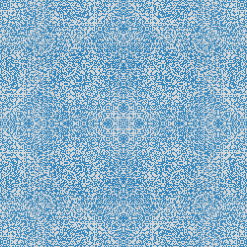

[](https://travis-ci.org/florian-mollin/lights-out-solver)

# Java Lights Out Solver
## Examples
### Example 1 : compute all solutions
<table>
  <tr><th>Start grid<br>(4×4)</th><th>Pattern<br>(Classic)</th><th>:arrow_right:</th><th>Final grid<br>(4×4)</th></tr>
  <tr>
    <td></td>
    <td></td>
    <td></td>
    <td></td>
  </tr>
</table>

```java
GridInterface startGrid = GridUtils.getEmptyGrid(4, 4);
GridInterface finalGrid = GridUtils.getFullGrid(4, 4);
PatternInterface pattern = PatternUtils.getClassicPattern();

Solver solver = new Solver(startGrid, finalGrid, pattern);
// compute all solutions
Solutions solutions = solver.solve();

System.out.println(solutions);
```

<table>
  <tr><th colspan='8'>Solutions</th></tr>
  <tr>
    <td></td>
    <td></td>
    <td></td>
    <td></td>
    <td></td>
    <td></td>
    <td></td>
    <td></td>
  </tr>
  <tr>
    <td></td>
    <td></td>
    <td></td>
    <td></td>
    <td></td>
    <td></td>
    <td></td>
    <td></td>
  </tr>
</table>

### Example 2 : compute first solution
<table>
  <tr><th>Start grid<br>(20×20)</th><th>Pattern<br>(Classic)</th><th>:arrow_right:</th><th>Final grid<br>(20×20)</th></tr>
  <tr>
    <td></td>
    <td></td>
    <td></td>
    <td></td>
  </tr>
</table>

```java
GridInterface startGrid = GridUtils.getEmptyGrid(20, 20);
GridInterface finalGrid = GridUtils.getFullGrid(20, 20);
PatternInterface pattern = PatternUtils.getClassicPattern();

Solver solver = new Solver(startGrid, finalGrid, pattern);
// compute only the first one solution (if exists)
Optional<Solution> firstSolution = solver.findFirstSolution();

firstSolution.ifPresent(System.out::println);
```

<table>
  <tr><th>First solution</th></tr>
  <tr>
    <td align="center"></td>
  </tr>
</table>

### Example 3 : custom grids
<table>
  <tr><th>Start grid<br>(3×3 custom)</th><th>Pattern<br>(Classic)</th><th>:arrow_right:</th><th>Final grid<br>(3×3 custom)</th></tr>
  <tr>
    <td align="center"></td>
    <td align="center"></td>
    <td></td>
    <td align="center"></td>
  </tr>
</table>

```java
// custom start grid
GridInterface startGrid = GridUtils.getGridWithSomeActivatedCoords(3, 3,
        Coord.of(0, 0), Coord.of(1, 0), Coord.of(2, 2)
);
// custom final grid
GridInterface finalGrid = GridUtils.getGridWithSomeActivatedCoords(3, 3,
        Coord.of(0, 1), Coord.of(1, 0), Coord.of(1, 1),
        Coord.of(1, 2), Coord.of(2, 1)
);
PatternInterface pattern = PatternUtils.getClassicPattern();

Solver solver = new Solver(startGrid, finalGrid, pattern);
Solutions solutions = solver.solve();

System.out.println(solutions);
```

<table>
  <tr><th>Solutions</th></tr>
  <tr>
    <td align="center"></td>
  </tr>
</table>

### Example 4 : custom pattern
<table>
  <tr><th>Start grid<br>(42×42)</th><th>Pattern<br>(Custom)</th><th>:arrow_right:</th><th>Final grid<br>(42×42)</th></tr>
  <tr>
    <td align="center"></td>
    <td align="center"></td>
    <td></td>
    <td align="center"></td>
  </tr>
</table>

```java
GridInterface startGrid = GridUtils.getEmptyGrid(42, 42);
// custom pattern
PatternInterface pattern = (coord) -> {
    return new HashSet<>(Arrays.asList(
            coord.add(Coord.of(1, 1)), coord.add(Coord.of(-1, -1)),
            coord.add(Coord.of(-1, 1)), coord.add(Coord.of(1, -1)),
            coord.add(Coord.of(1, 0)), coord.add(Coord.of(0, 1)),
            coord.add(Coord.of(-1, 0)), coord.add(Coord.of(0, -1))
    ));
};

// by default, finalGrid is full
Solver solver = new Solver(startGrid, pattern);
Optional<Solution> firstSolution = solver.findFirstSolution();

firstSolution.ifPresent(System.out::println);
```

<table>
  <tr><th>First solution</th></tr>
  <tr>
    <td align="center"></td>
  </tr>
</table>


## For fun
### Fun 1
<table>
  <tr><th>Start grid<br>(250×250)</th><th>Pattern<br>(Classic)</th><th>:arrow_right:</th><th>Final grid<br>(250×250)</th></tr>
  <tr>
    <td align="center"></td>
    <td align="center"></td>
    <td></td>
    <td align="center"></td>
  </tr>
</table>
<table>
  <tr><th>Solution</th></tr>
  <tr>
    <td align="center"></td>
  </tr>
</table>

### Fun 2
<table>
  <tr><th>Start grid<br>(250×250)</th><th>Pattern<br>(Custom)</th><th>:arrow_right:</th><th>Final grid<br>(250×250)</th></tr>
  <tr>
    <td align="center"></td>
    <td align="center"></td>
    <td></td>
    <td align="center"></td>
  </tr>
</table>
<table>
  <tr><th>Solution</th></tr>
  <tr>
    <td align="center"></td>
  </tr>
</table>
